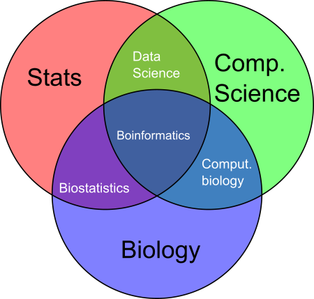
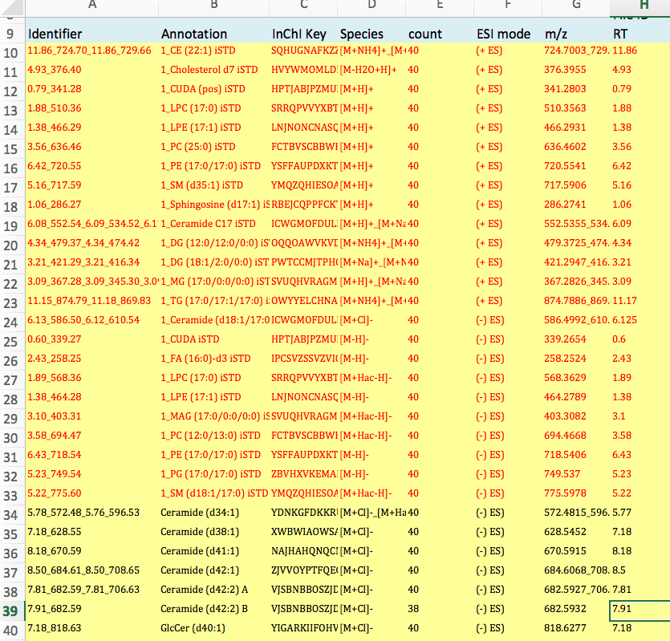
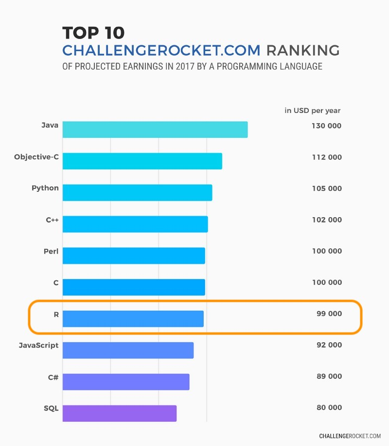
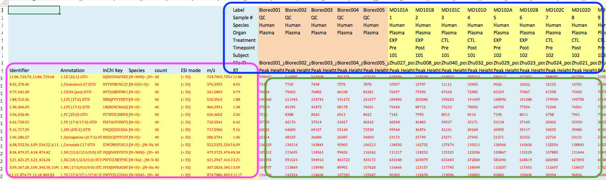
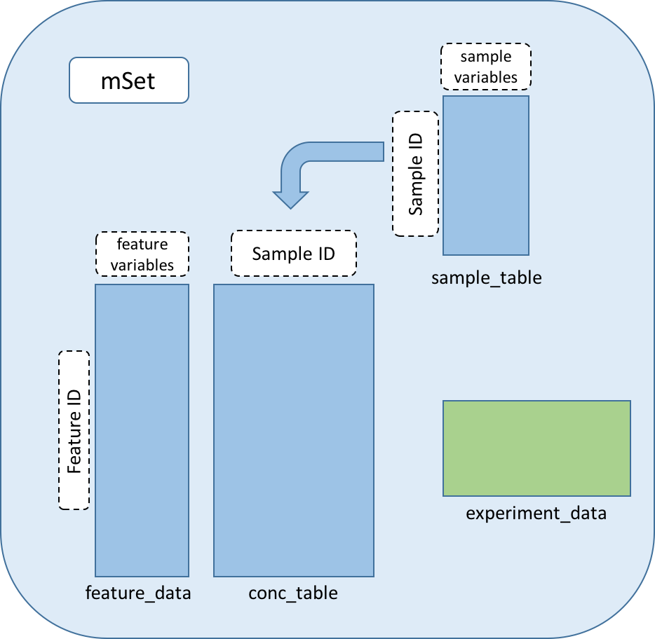

<link rel="stylesheet" href="https://cdnjs.cloudflare.com/ajax/libs/font-awesome/4.7.0/css/font-awesome.min.css">
<script src="https://ajax.googleapis.com/ajax/libs/jquery/3.1.1/jquery.min.js"></script>

<script>
  $(document).ready(function() {
    $('slide:not(.backdrop):not(.title-slide)').append('<div class=\"footnotes\">');

    $('footnote').each(function(index) {
      var text  = $(this).html();
      var fnNum = (index+1).toString().sup();
      $(this).html(text + fnNum);

      var footnote   = fnNum + ': ' + $(this).attr('content') + '<br/>';
      var oldContent = $(this).parents('slide').children('div.footnotes').html();
      var newContent = oldContent + footnote;
      $(this).parents('slide').children('div.footnotes').html(newContent);
    });
  });
</script>


```{r setup, include=FALSE}
knitr::opts_chunk$set(echo = FALSE, warning = FALSE, message = FALSE)
```

## High through-put experiments {.build}

High through-put experiment (HTE) uses approaches such as sequencing techonology, Mass Spectrometry based analytical chemistry methods to study the quality or quantity of a large number of features such as nucleic acid sequences, proteins, small molecules, or other features in biological or enviromental specimens, or study subjects.

```{r}
library(DiagrammeR)
grViz("
digraph study_workflow{

graph [ layout = dot, overlap = false ]

node [fixedsize = true, width = 1.5,
      fontname = 'Helvetica', style = filled, fontsize = 20]

node [ shape = circle, fillcolor='#AA1100', fontcolor = 'white' ]
a [ label = 'Specimen\n/Subject' ]

node [shape =circle, fillcolor='#AA660055', fontcolor = 'black']
b [ label = 'DNA' ]
c [ label = 'DNA\nmodification' ]
d [ label = 'RNA' ]
e [ label = 'Protein' ]
f [ label = 'Samll\nMolecules' ]
g [ label = 'Clinical and\nanthropometry\nvalues' ]
h [ label = 'Dietary\nNutrients' ]
i [ label = 'Cellular\nfunctions' ]

node [shape = circle, fillcolor='orange']
j [ label = 'Genomics' ]
k [ label = 'Metagenomics' ]
l [ label = '16S-seq' ]
m [ label = 'Chip-seq' ]
n [ label = 'RNA-seq' ]
o [ label = 'Proteomics' ]
p [ label = 'Metabolomcis' ]
q [ label = 'Lipidomics' ]
r [ label = 'Biogenic\namines' ]
s [ label = 'Bile\nacids']

a -> b -> c; a -> d; a -> e; a -> f; a -> g; a -> h; a -> i

b -> j; b -> k; b -> l; c -> m; d -> n; e -> o; f -> p;
p -> q; p -> r; p -> s

}")
```

## Biology and Data Science {.build}

Data science is an interdisciplinary field that uses scientific methods, processes, algorithms and systems to extract knowledge and insights from data in various forms.




## High Through-put Experiment Data {.build}

<div>
* The starting point of a high through-put experiment is usually raw sequencing data.
</div>
<div>
* fastq files for microbiome, metagenomics, RNA seq, etc
</div>
<div>
* mzML/mzXML MS files for proteomics (and **maybe** metabolomics)
</div>

```{r flow-chart, fig.align='center'}
grViz("
digraph bio_flow{

graph [rankdir = LR]

node [shape = rectangle, fixedsize = true, width = 1.5, fontcolor = '#333333',
      fontname = 'Helvetica', fillcolour = yellow, style = filled, 
      height = 1, fontsize=15 ]

edge [fontname = 'Helvetica', fontsize=15, fontcolor = '#AA2200']

node [fillcolor='orange']
a [ label = 'Raw\nSequencing\nData' ]
b [ label = 'Tabular\nData' ]
c [ label = 'Statistic\nTest' ]
d [ label = 'Visualizations' ]
e [ label = 'Manuscript' ]

a -> b [ label = 'Data\nProcessing' ]
b -> c [ label = 'Data\nAnalysis' ]
b -> d
c -> e
d -> e
}
")
```

## Data Processing and Analysis {.build}
<div>
* Should be standardized, clear and reproducible.
</div>
<div>
* High through-put experiments data processing is the assay- or experiment-dependent, but not study dependent. The data processing precedure doesn't change with the study design.
</div>
<div>
* Proteomics: X!Tandem
</div>
<div>
* 16S-seq: fastq-multx, cutadapt/trimmomatic/fastx-toolkit, DADA2
</div>
<div>
* After we generate the tabular data from data processing, the data analysis step is study dependent. Different statistic model and visualization approaches can be used base on the study design.
</div>

## Basic Principle of Data Science {.build}

<div>
* Principle of tidy data
</div>
<div>
* Reproducibility
</div>
<div>
* Why R
</div>
<div>
* Version Control (git)
</div>
<div>
* Data structure of hight through-put experiment data
</div>
## Tidy Data {.build}

1. Each measured variable should be in one column.
2. Each different observation of that variable should be in a different row.
3. There should be one table for each "kind" of variable.
4. If you have multiple tables, they should include a column in the table that allows them to be linked.

<footnote content="Hadley Wickham, Tidy Data"></footnote>
<footnote content="Jeff Leek, The Elements of Data Analytic Style"></footnote>

## Tidy Data continue {.build}

1. Each measured variable should be in one column.
2. Each different observation of that variable should be in a different row.

<div class="iframe-container">
<iframe src="widget/clinical.html"></iframe>
</div>

## Messy Data Example {.build}



## Reproducibility {.build}

<div>
* <p class="emphesize">The raw data should be stored well and every analysis step should be documented. </p>
</div>
<div>
* Reproducibility allows you to be validate you analysis, and collaborate with other people. 
</div>
<div>
* Using programming language is the best way to make your analysis reproducible.
    
    - SAS
    - R
    - Python
    - Julia

## Why R {.build}

<div>
* R is a programming language designed for statistics and data analysis. R's native packages can support almost all basic statistics test (linear model, t test, correlation, etc). 
</div>
<div>
* R has tremendous amount of additional packages on [CRAN](https://cran.r-project.org/) that extend the functionality of R for almost all fields (ecology, chemistry, engineering, etc.)
</div>
<div>
* The [bioconductor](https://www.bioconductor.org) project has also a lot of packages designated for bioinformatics, contributed by scientists all over the world.
</div>
<div>
* Very popular in academic community.
</div>
<div>
* Almost all R packages have very detailed documentations
</div>
<div>
* Ability to generate scientific report/presentations in different forms, including html, pdf, slides, and word docx.
</div>

## Why R cont.

R is also a good choice for a career!



## Version control

* <i class="fa fa-git"></i> Git: a distributed version control system
* <i class="fa fa-github"></i> Github, a web-based hosting service for git
    - Pros: 
        + Use as a static html service
        + Multiple people can work on the same project
    - Cons:
        + Public to the world unless you pay
        + Single file size limit

## Metabase {.build}
<div>
* The Metabase is a R pacakge provides a solution to store, handle, analyze, and visualize data from quantitative experiments such as metabolomics and proteomics.
</div>
<div>
* Now only the metabolomics data is well implemented, but it will be able to support any quantitative experiment data, including metabolomics, proteomics, glycomics, nutrient data, anthropometric and clinical data, biochemical assays.
</div>
<div>
* github repo: github.com/zhuchcn/Metabase
</div>

## Hight Thoughput Experiment Data Structure {.build}

<div>
Almost all high thoughput experiment data have 3 tables:
</div>
<div>
* A table with information to each feature (pink box)
</div>
<div>
* A table with information to each sample (blue box)
</div>
<div>
* A pure numeric table of the intensity/concentration/abundance of each feature in each sample (gree box)
</div>



## Metabase Design

* The Metabase uses the **Object Oriented Design**. 



## Classes Roadmap

Only MetabolomicsSet, LipidomicsSet and MultiSet are available now. ProteomicsSet and GLycomicsSet are not done yet.

<br />

```{r}
grViz("
digraph mSet_classes{

graph [ layout = dot, overlap = false ]

node  [ fixedsize = true, width = 1.8, shape = rectangle,
       fontname = 'Helvetica', style = filled, fontsize = 15 ]

node  [ fillcolor = '#AA2200', height = 0.8, fontcolor = 'white' ]
a [ label = 'mSet\n(virtual)' ]

node [ fillcolor = '#AA660055', height = 0.5, fontcolor = 'black' ]
b [ label = 'MetabolomicsSet' ]
c [ label = 'LipidomicsSet' ]
d [ label = 'MultiSet' ]
e [ label = 'ProteomicsSet' ]
f [ label = 'GlycomicsSet' ]

a -> b -> c
a -> d
a -> e
a -> f

}
")
```

## Documentation

<i class="fa fa-book"></i>  [www.chenghaozhu.net](http://www.chenghaozhu.net)
